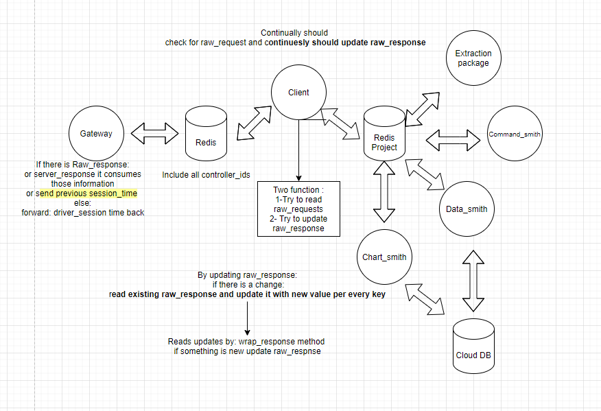
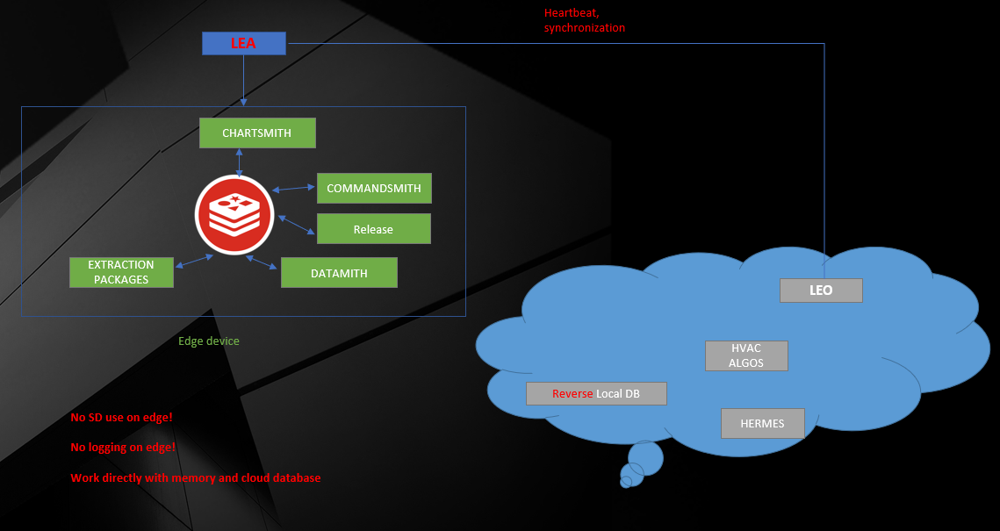

# EXTRACTION module

NOTES: 1. default behavior of write status to db, 2. comparison between previous setting and new setting regarding the db data

## Overview

Extraction module is part of the LEA ecosystem, which is committed to oversee the modules status of parse, release commands, extract points, and data pushing.

Redis is massively used in this package and almost all of modules interact with Redis to gather the config information. However, instead of using one centralized Redis that served as Gateway Redis, we also implemented the Redis for each **Project/Building.** For each, all the information, say, updates, errors, discovery\_points, etc, will be transferred from the Gateway Redis to Project Redis once we receive from driver, via project CLIENT program, and all the operations will be conducted there. By doing this, transparency, distribution and maintainability are the vectors we seriously considered and improved.

In addition, we accomplished the parallel reading, parsing and pushing [updates ](extraction-module.md#updates)by duplicating the extraction modules and creating services for each of them. In specific, say we have two extraction modules for project A, each will take half of updates, parse and push to database. The philosophy behind this design is that usually once a updates data coming, we parse them by one extraction module, but it will risk our virtual machine to go to a resource consumption peak and result in some consequential effects to other program if the updates are enormous. Using of parallelization technique directly help us eliminate this kind of possible negative influences by turning one huge peak to two smaller wave.

In this upgrading, we not only covered one single extraction mode, but two simultaneously. The previous version of extraction only serve one extraction mode without possible switching, we instead make our package adaptive to the mode changes. In other words, it's expected that when there is a need to switch extraction mode from haystack \(read extraction list from hs\_points and push to hs\_measure\) to convention \(read extraction list from file and push to TL\_measures\) or vice versa could be managed automatically without human intervention. Even for both mode at the same time, the package is also capable for doing it. This will give us a huge amount of conveniences when a switching is required.

To give a general picture of how entire architecture looks like:



NOTE: Any terms that causes confusion, please refer to [Terminologies Section](extraction-module.md#terminologies-definition)

### LEA



## Environments

This project is massively applied with Redis database, so it's mandatory to have it installed, both redis server and python redis packages.

A list of required external packages:

1. redis
2. psutil
3. environ
4. pandas
5. pymysql
6. sqlalchemy

## Modules

The Extraction package includes two modules: Init\_Extraction and Extraction, both are able to run independently but need small modifications. The following description will speak from the perspective of a whole.

The **Init\_Extraction** module is the first of first module to execute in Extraction package, it takes the full responsibilities of **reading from config file and updating of every modules to Redis database**, and other modules, such as Extraction will read config from Redis rather than from file. Considering it as root, all other program takes information from here.

The **Extraction** module takes care of the duties of reading, parsing and pushing the updates that we received from Brainbox AI driver. The updates data originally sit on our [**Gateway** Redis](extraction-module.md#gateway-redis) for its corresponding controller id, and it will be taken by our **project** CLIENT program and push to our [**Project** Redis](extraction-module.md#project-redis). Starting from Project Redis with all piece of information related to this project, the extraction module is able to perform the parsing operation.

### Init\_Extraction

In general, Init Extraction is the modules that responsible for [initializing ](extraction-module.md#initialization)the extraction.

#### Flowchart

The init extraction module in Extraction package is designed in the below way.


#### Highlight Points:

1. If the extraction list changes, which indicates we would like to subscribe/tell our driver there is some different points we would like to have visuals, we have to first send a command "unsubscribe\_all" to our driver via gateway redis, which informs our driver "we don't want you to send any points value back to us", then follows the steps mentioned [here ](extraction-module.md#initialization)to re-initialize the extraction
2. Another circumstance that a re-initialization is required is at the time the extraction mode is switched \(convention, haystack, dual mode\), this has been automated in the extraction module. 
3. This module is run as an independent service at tgw VM with infinite loop

### Extraction

This module will handle the scenario of needs of reading, parsing and pushing updates to our database.

#### Flowchart


#### Highlight Points:

1. As stated in [Overview](extraction-module.md#overview), Extraction supports mode switching and dual mode
2. As stated in [Overview](extraction-module.md#overview), Extraction supports parallel reading, parsing and pushing
3. All extractions modules, say, extraction\_1 and extraction2, are run as independent service in tgw VM, the [wave\_counter ](extraction-module.md#wave-counter)will be different but close enough. 
4. [Extraction cycle](extraction-module.md#extraction-cycle) table will log all the information related to this extraction loop, either success or fail. One crucial point is the wave counter in extraction cycle table match the data in measures.

## Quick Start

### Install modules

The installation follows the general steps:

1. Download the code: git clone [https://git.brainboxai.net/DataStreams/LEA\_IO\_modules\_Tridium](https://git.brainboxai.net/DataStreams/LEA_IO_modules_Tridium)    
   1. enter your git username and password
2. Change the configuration file adaptively 
   1. list of configuration files:
      1. **InitExtraction/extraction\_config.json**: all necessary attributes for running the extraction modules
      2. **DataSmith\_\#/DS\_config.json:** majorly use redis channel name, the preloaded message redis name, and the size of each pushing to database
      3. **utils/.env**: the password and username of the database
      4. **utils/config.json**: the configuration required for connecting to database, such as table names, database name and server name
      5. **CLIENT\_CONFIGURATION.json**: the extraction mode is controller here; also the controller ids in this project are included here \(a must; otherwise the program won't executed properly\). 
      6. **service\_creator/service**_**\_**_**CONFIGURATION.json**: the configurations for creating the system service for running the modules on background. Support multiple services creation.
3. Set up the Redis socket server:
   1. No need to change anything in this step
   2. Simply run `python3 redisConfiguration/prepare_redis_conf.py` 
   3. \(when there is a need to stop such server, run _redisConfiguration/steop\_redis\_service.py_, this will not affect the data that already stored in redis database\)
4. Once you feel confident about the configurations setting, feel free to use sudoer permission to run `python3 service_creator/service_creator.py`
5. After creation of service, it's necessary to do extra quality assurance, which is use command line of `sudo systemctl status yourservicename.service` to check if the service is up and run, in case of failure, run `sudo systemctl restart yourservicename.service`, and recheck the status. If still failed, double check your configurations file.

### Frequent scenarios and its measures

This section assumes the related service is running on background.

#### Reinit extraction

In _InitExtraction/extraction\_config.json_, swith attribute of "init" from false to **true,** save and exit. The service of _InitEXTRACTION_ will take of the changes and proceed to reinit the extraction.

#### Change of extraction mode

Under CLIENT\_CONFIGURATION.json file, there are two attributes: 

1. haystack\_ext\_mode: boolean; controls if the extraction is on [haystack extraction mode](extraction-module.md#single-mode)
2. dual\_ext\_mode: boolean; controls if the extraction is on [dual extraction mode](extraction-module.md#dual-mode)

Please note that, the program will first check if we are in dual extraction mode, if yes, it will omit if haystack extraction mode is on or off. Likewise, if dual is off, then the program will check which single mode we are directing, haystack or conventional.

#### Debug mode

The [debug mode](extraction-module.md#debug-mode-1) is available for modules:

1. Client
2. Init Extraction/ Extraction
3. Data Smith

Once this mode is on, the verbose will be maximized and print every details on each turning points.

#### Change of extraction module duties

By default, each extraction package is equipped with two extraction modules, and their responsibilities was split by the _extraction\_config.json,_ for example, 

1. **"extraction1\_duties":\["f6b9c110-83da-30ed-91ab-9c3dbd6b108e\_updates\_300\_\[0-4\]"\]**
2. **extraction2\_duties":\["f6b9c110-83da-30ed-91ab-9c3dbd6b108e\_updates\_300\_\[4-9\]"\]**

Partition explain:


so, the generic format of extraction duties: **controllerID\_updates\_theIntervalOfUpdates\_theSubscriptionID**

OR 

with [COV ](extraction-module.md#cov-change-of-value)\(change of value\):

**controllerID\_updatestheIntervalOfUpdates\_COV\_theSubscriptionID**

Among them:

1. controller id: offered by driver, the unique id
2. updates: "updates" field name, no need to change
3. interval: the interval between two updates, say 5 mins, the driver will send us the latest updates in every 5 mins. Some point may come with different intervals
4. [subscription ID](extraction-module.md#initialization): the subscription number of the updates, say, we have 9 groups of subscriptions, the duties could be split like above. 
5. COV: [cov](extraction-module.md#cov-change-of-value)

#### Change of pushing to database size

Under the needs of considering the resource consumption of virtual machine, we configurate the database pushing size to a reasonable number. For example, if the cpu and memory consumption is in a very high level, then we shall reduce the pushing size and let the program do the populating for multiple times in order to flatten the curve. 

In each of Data Smith directory, database pushing size could be found at DS\_config.json, it varies by different data smith. 

#### Extraction only for locally, stop pushing to cloud database

In the special case, there is no need to push the extraction point of values to the database. In the extraction\_config.json, switch write to db option to false. 

## Functionalities

### Dual mode

The extraction package supports the dual mode of extraction. In particular, it allows itself to subscribe the points to driver based on a joint extraction list from conventional and haystack approach, in which, conventional mode push updates to TL measures table, while haystack mode push to hs measures.

One thing that requires extra concern is the joint extraction list. Under the circumstance of lack of a joint extraction list that prepared by Data Mapping team, we shall merge the individual extraction list together by the key of "point address", e.g. _/Drivers/BacnetNetwork/$31$2d10/points/CLG$2dMAXFLOW_. Among them, the conventional extraction list is preserved in the file format of csv that provided by Data Mapping team and haystack extraction list could be found at hs points of each project in AWS database.

In another case, the joint extraction list is prepared by Data Mapping team and could be directly read as data frame and do the initialization of extraction.

### Single mode

As its mode name implies, this is only for extraction for one single mode, either Haystack or Conventional approach. The difference is they may have different extraction list, and push to different tables \(haystack: hs\_measures; conventional: TL\_measures\). 

### Rich report

In this module, we are committed to log program running details as much as possible. It would be one of the ways to collect data for the future integration of Machine Learning application and Software Engineer, such as Smart Operation project.

The examples that covered are:

1. program running time in secs
2. whether or not the extraction is success
3. the number of normal/status updates
4. which extraction mode is currently on
5. The offset between creation of updates and creation of database row
6. CPU/memory consumption of this program
7. CPU/memory consumption machine-wide
8. updates with status, if any
9. current cycle configuration
10. current data smith configuration

### Memory garbage collection

The execution of program is in the format of hierarchy. By this, it means it was implemented with multiple levels of calling modules. Particularly, there is a main script \(e.g. EXTRACTION\_1.py\) that takes care of running the script runner \(e.g. extraction.py\). In this design, the main script will be embedded with a **while True** loop, and script runner will contain a runner\_main function that serves as the caller of main business logic of the present script, which equips a **for loop** and maximum iteration number in the configuration file. 

By doing so, after running out of the for loop of script runner, it will exit itself to clean up all the allocated memory in order to achieve the goal of the garbage collection operation. In the next cycle, the program will go back to main script while loop, and start another script runner.  

### Massive use of Redis

As you may notice, this is a project that massively applied Redis, which is a memory-based database with extremely fast read/write ability.

Two major applications:

1. Use of redis database to store temporary data from our driver, extraction list, module status, etc
2. Use of redis channel to listen and collect data from another endpoint, in specific, the parsed data will be pushed to redis channel and [Data Smith](extraction-module.md#data-smith) module will take this data and push to its requested database

### Immediate effect of configuration change

This applies to every modules involved in this project, extraction, init\_extration, client, etc. 

The extraction configuration file changes would be immediately effect to the production, for example, while one of the attribute modified in configuration file, the [init\_extraction module](extraction-module.md#modules) will automatically detect and read it and write to redis, which will later be consumed by other program, same for client module.  

### Debug mode

This enables the maintainer debug the module with print almost all information in the pipeline, so that it's time-saving to manually print the message of where the error occurred.

With the debug mode on, the module will output the data in every major turning points and give a heads-up for every details for debugging. 

### Push to extraction cycle table even if extraction failed

Even if the extraction of points failed, the module is able to push the error message to the database, along with the extraction mode, CPU and memory consumption, current configuration, pushing size, etc.

### Rich options 

#### Write to database

Refer to [here](extraction-module.md#frequent-scenarios-and-its-measures)

#### Delete after read

Instead of deleting the data after reading by default, it is possible that we keep the data there after fetching it, example: the extraction module will remove the updates from redis database after reading, if off, even the data has been read, it will still be kept as it originates.

#### Points with status

[Status points](extraction-module.md#status-points)

1. Whether or not write points with status to database, default at NO, in other words, all points come with status \(abnormal\) will collected into the **detailed report** column in **extraction cycle** table by default
2. Options to choose which status write to database and rest of them will be kept in the **detailed report** column in **extraction cycle** table 
3. Options to choose which columns of status points kept into detailed report: default at \[point value, status, URI, point id\]

### Extraction module duties

Refer to [here](extraction-module.md#frequent-scenarios-and-its-measures)

### Heart beat/modules status

Refer to [here](extraction-module.md#heart-beat)

### Data smith pushing by configurable size

Refer to [here](extraction-module.md#frequent-scenarios-and-its-measures)

### Auto check the changes in configuration file

The modules of CLIENT and InitEXTRACTION will check if the configuration file is different with the configuration in the memory, which means the configuration has been updated by a user. The modules will push the latest configuration to the redis memory database for other program to use. 

## Terminologies Definition

### Gateway/Project Redis

#### Gateway Redis

This is the primary, centralized Redis database for storing all communication information related to the specific controller id, such as raw request, raw response, controller id, session time, current time, etc, this is the transfer hub of our brainbox gateway and client driver.

#### Project Redis

This is designed for each of project/building, which means that for each of project, one Redis object will be available for each to place any related data with a controller id as prefix, such as controllerID\_current\_time. It is beneficial for maintenance of each project/building as well as modules.

### Data Smith

Part of LEA, an application of redis channel, listen to the specific channel and then push the received data to desired database table.

### Initialization

By meaning of _Initialization,_ it follows these steps:

1. Based on the extraction list \(the points we desired to acquire from driver\)
   1. split the list to several smaller chunks according to the configurable chunk size
   2. assign those chunks name, such as _"controllerID\_1", "controllerID\_COV\_2",_ varied by the type of extraction \(ordinary or COV\) 
   3. put everything together and send to our gateway redis and wait for driver to take and execute
   4. Another name for the above procedures is **Subscription -** in short, tell our driver we want those points value to be sent to us in a certain time interval.
2. Reinit means we are refreshing the extraction list/subscription list and let the driver be aware of the latest ones. 

### Updates

Very straightforward, after we initialized extraction, the driver will then send the points values that we have in the extraction list to us, in a timely manner. Those bunch of points values, we name'em Updates.

### Wave counter

The unix time of a timestamp

### Extraction cycle

The table that sits in database that responsible to log all the information related to this specific extraction cycle

The wave counter will be used as a reference to match the updates data back to measures table

### Heart beat

Heart beat is a concept that we used to keep track of the execution status of each modules inside a package. It offers the maintainers to have visibilities on which service/module is running, and which is possibly down. It also give data smith the opportunities to refresh itself; It works under such cases:

1. after a success execution of main program
2. while waiting for the results from the driver, it does not insert the hear beat unless the difference between heart beat current time and the latest time in heart beat in memory is over a heart beat threshold \(means the data smith has been IDLE for threshold of time\), and then push the renewal code \(in our case, 100\) to data smith
3. Once data smith listened a message of renewal code, it will dispose itself engine and recreate a new one. 

### COV \(change of value\)

This tells the driver only send the corresponding point value if and only if the value is changed from last update.

### Release

This will cancel the command that we write to the driver; Likewise, _release\_all_ will wipe out all of current commands. 

### Status points

Normally, each point is supposed to be normal condition, as a result, the update of each points only return the internal id, the wave counter and its point values. However, in such case that the point is not in normal condition, which implies that this point is having "status", it have fourth value in the updates, and it's the representation of the status of that point. As long as status is not empty, it's classified as status/abnormal points. Examples of status: fault, down, alarm, etc. 

## Configurations

### Example

Here is one example configuration for the office test bench TRIDIUM device:

```text
{
  "init": false,
  "sleep_time":4,
  "retry_times":3,
  "ext_itt_max":60,
  "debug_mode":false,
  "write_to_db":true,
  "delete_after":true,
  "unsub_max_itt":170,
  "refetch_ext_list": false,
  "subscription_chunk": 500,
  "heart_beat_name":{"Extraction_1":"EXTRACTION_1",
                    "Extraction_2":"EXTRACTION_2",
                    "InitExtraction":"InitEXTRACTION"},
  "hb_threshold":900,
  "hb_renewal_code":100,
  "haystack_ext_table_name": "hs_points",
  "latest_hs_points_updated":"2021-04-29 00:44:09",
  "convention_ext_list": "convention_extraction_list.csv",
  "combined_hs_conv_ext_list":"combined_hs_conv_ext_list.csv",
  "extraction_1_duties":["f6b9c110-83da-30ed-91ab-9c3dbd6b108e_updates_300_[0-4]"],
  "extraction_2_duties":["f6b9c110-83da-30ed-91ab-9c3dbd6b108e_updates_300_[4-9]"],
  "convention_ext_list_colName":["URI",	"DB_name", "value",	"obj_type",	"controller_id",	"system",	"point_name",	"units",	"extraction_frequency",	"writable",	"COV",	"bk_check",	"internal_index",	"c_id"],
  "haystack_ext_list_colName":["id","DB_name","equipId","value","kind","units","writable","controller_id","obj_type","URI","addressType","COV","extraction_frequency","maxExtractionFrequency","createdBy","createdAt","updatedBy","updatedAt"],
  "status_flag_write_to_database":["fault", "alarm", "down"],
  "write_status_to_database":false,
  "dest_table":{"haystack":"hs_measures",
                "convention":"TL_measures"},
  "merge_key":{"haystack":"id",
              "convention_or_dual":"internal_index"},
  "updates_columnNames":{"haystack":["id", "source_ts_utc", "point_value", "status"],
                        "convention_or_dual":["internal_index", "source_ts_utc", "point_value", "status"]},
  "variable_columnNames":{"created_by":"created_by",
                      "source_ts_utc":"source_ts_utc",
                      "creation_date_utc":"creation_date_utc",
                      "point_value":"point_value",
                      "status":"status",
                      "wave_counter":"wave_counter",
                      "cov" : "COV",
                      "controllerId": "controller_id",
                      "extractionFrequency": "extraction_frequency",
                      "pointAddress": "URI",
                      "point_id":"DB_name",
                      "updatedAt":"updatedAt"},
  "monitory_name":{
                  "Extraction_1": "Extraction_1",
                  "Extraction_2": "Extraction_2"},
  "keep_keys_status":{
                  "haystack":["point_value", "status", "URI", "dis"],
                  "convention":["point_value", "status", "URI", "point_id"]},
  "keep_ext_list_colNames_to_redis":{"haystack":["id","equipId", "DB_name", "value", "kind", "units",
                                        "writable", "controller_id","obj_type", "URI", "addressType",
                                        "COV", "extraction_frequency","maxExtractionFrequency", "createdAt"],
                                      "dual":["id","equipId", "DB_name", "kind", "units","system", "point_name",
                                              "writable", "controller_id","obj_type", "URI", "addressType",
                                              "COV", "extraction_frequency","maxExtractionFrequency", "internal_index"]},
  "dest_table_keep_colNames":{"haystack":["point_id", "point_value", "wave_counter", "created_by", "creation_date_utc", "source_ts_utc"],
                              "convention":["point_id", "controller_id", "system_id", "point_name", "point_type", "unit", "point_value", "creation_date_utc", "wave_counter"]},
  "dest_table_columns":{
                  "TL_measures":{
                    "c_id":"controller_id",
                    "system":"system_id",
                    "obj_type":"point_type",
                    "value":"point_value",
                    "DB_name":"point_id",
                    "units":"unit"},
                  "hs_measures":{
                    "value":"point_value",
                    "id":"point_id"
                  },
                  "extraction_cycle":{
                    "cycle_duration":"cycle_duration",
                    "wave_counter":"wave_counter",
                    "report":"report",
                    "detailed_report":"detailed_report"}
   }
}
```

### Explain

Bullet point explain

```text
{
  "init": [if we need to reinit the extraction],
  "sleep_time": [how long the program sleep for next cycle of extraction],
  "retry_times": [this give initextraction module chance to retry itself for unsubscribe all],
  "ext_itt_max":[the max itteration of one cycle in for loop],
  "debug_mode": [the debug mode boolean],
  "write_to_db": [the switch to control write data to database or not],
  "delete_after": [if we need to delete data after reading from redis],
  "unsub_max_itt": [for one try of unsubscribe all, number of itteration],
  "refetch_ext_list": [if we need to refetch latest extraction list from the database],
  "subscription_chunk": [this is used as a data chunker for initializing the extraction, every subscription_chunk will be grouped in one chunk],
  "heart_beat_name": [the heart beat name for each of modules, such as ext 1; ext 2; init ext],
  "hb_threshold": [the threshold of sending the heartbeat, if exceeded, pass renewal code to data smith],
  "hb_renewal_code": [the renewal code defined internally],
  "haystack_ext_table_name": [the database table name of haystack point, which is the extraction list for haystack mode],
  "latest_hs_points_updated": [the updated time of the haystack extraction list in database, if the max value in database is greater than this threshold, refetch and resubscribe],
  "convention_ext_list": [the local csv file name for convention method extraction],
  "combined_hs_conv_ext_list": [the local csv file name for dual method extraction],
  "extraction_1_duties": [the duties for extraction 1 module, details refer to section "Frequent scenarios and its measures"],
  "extraction_2_duties": [the duties for extraction 2 module, details refer to section "Frequent scenarios and its measures"],
  "convention_ext_list_colName": [this is the column name for convention extraction list, for a reference purpose, make sure the same info between convention and haystack has the same column name],
  "haystack_ext_list_colName": [this is the column name for haystack extraction list, for a reference purpose, make sure the same info between convention and haystack has the same column name],
  "status_flag_write_to_database": [this marks the status flag, say, fault, will be written to database, the rest status points will direct to extraction cycle table detail],
  "write_status_to_database": [are we gonna write the points with status to database? if not, collect them all into the detailed report],
  "dest_table": [what is the destination pushing database table name for convention and haystack],
  "merge_key": [what is the key to merge between extraction list and the updates],
  "updates_columnNames": [what is the column names of the updates for convention and haystack],
  "variable_columnNames": [contains the column names, which is variable and could be changed later, key is used in program, value is the real name],
  "monitory_name": [the monitory name for different extraction module, used to differenate the different monitory],
  "keep_keys_status": [this highlights the most important columns that will be kept for the status point ],
  "keep_ext_list_colNames_to_redis": [the extraction list columns that will be kept to redis database as reference],
  "dest_table_keep_colNames": [the column names that used in filtering and accumulating the data points and push to data smith/database, varied by different extraction mode and measures table],
  "dest_table_columns": [the key:value pair of the replacement of column names between merged ext_list/updates data and database table column name]
}

```

## Issues

### Frequent encountered issues

1. After first time of running service creator and check the status of the corresponding service, it shows the failure of running. 
   1. try to restart the service, if it turns to success, no need to concern more; if stay still, recheck the configurations to see where is missing
2. From system log of service, it appears the NameError of a controller id
   1. make sure you fill you updated/all controller id in CLIENT\_CONFIGURATION.json
3. Extraction module works without any errors but there is no updates and extraction cycle information pushed to database
   1. wait for another interval of updates and then check the status and log of data smith
4. Configurations are confidently appropriate, extraction failed: please address the issue by this [request form](https://form.asana.com/?hash=5081ac7e18e3c187f0e22118243d9992499d8afb9b84b69cc9a9150619a3f408&id=1188278485288441).
5. 
## Collaborators

