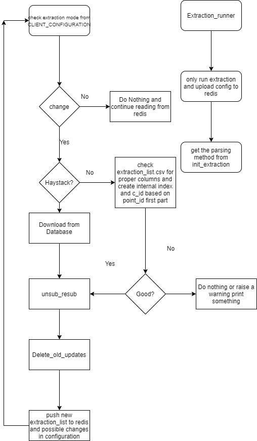

# EXTRACTION module

## Overview

Extraction module is part of the LEA ecosystem, which is committed to oversee the modules status of parse, release commands, extract points, and data pushing. 

Redis is massively used in this package and almost all of modules interact with Redis to gather the config information. However, instead of using one centralized Redis that served as Gateway Redis, we also implemented the Redis for each **Project/Building.** For each, all the information, say, updates, errors, discovery\_points, etc, will be transferred from the Gateway Redis to Project Redis once we receive from driver, via project CLIENT program, and all the operations will be conducted there. By doing this, transparency, distribution and maintainability are the vectors we seriously considered and improved.

In addition, we accomplished the parallel reading, parsing and pushing [updates ](extraction-module.md#updates)by duplicating the extraction modules and creating services for each of them. In specific, say we have two extraction modules for project A, each will take half of updates, parse and push to database. The philosophy behind this design is that usually once a updates data coming, we parse them by one extraction module, but it will risk our virtual machine to go to a resource consumption peak and result in some consequential effects to other program if the updates are enormous. Using of parallelization technique directly help us eliminate this kind of possible negative influences by turning one huge peak to two smaller wave. 

In this upgrading, we not only covered one single extraction mode, but two simultaneously. The previous version of extraction only serve one extraction mode without possible switching, we instead make our package adaptive to the mode changes. In other words, it's expected that when there is a need to switch extraction mode from haystack \(read extraction list from hs\_points and push to hs\_measure\) to convention \(read extraction list from file and push to TL\_measures\) or vice versa could be managed automatically without human intervention. Even for both mode at the same time, the package is also capable for doing it. This will give us a huge amount of conveniences when a switching is required. 

To give a general picture of how entire architecture looks like:

NOTE: Any terms that causes confusion, please refer to [Terminologies Section](extraction-module.md#terminologies-definition)

### LEA

## Environments

This project is massively applied with Redis database, so it's mandatory to have it installed, both redis server and python redis packages.

A list of required external packages:

1. psutil
2. 
## Workflow

The Extraction package includes two modules: Init\_Extraction and Extraction, both are able to run independently but need small modifications. The following description will speak from the perspective of a whole.

The **Init\_Extraction** module is the first of first module to execute in Extraction package, it takes the full responsibilities of **reading from config file and updating of every modules to Redis database**, and other modules, such as Extraction will read config from Redis rather than from file. Considering it as root, all other program takes information from here.

The **Extraction** module takes care of the duties of reading, parsing and pushing the updates that we received from Brainbox AI driver. The updates data originally sit on our [**Gateway** Redis](extraction-module.md#gateway-redis) for its corresponding controller id, and it will be taken by our **project** CLIENT program and push to our [**Project** Redis](extraction-module.md#project-redis). Starting from Project Redis with all piece of information related to this project, the extraction module is able to perform the parsing operation.

### Init\_Extraction 

In general, Init Extraction is the modules that responsible for [initializing ](extraction-module.md#initialization)the extraction. 

#### Flowchart

The init extraction module in Extraction package is designed in the below way. 

#### Highlight Points:

1. If the extraction list changes, which indicates we would like to subscribe/tell our driver there is some different points we would like to have visuals, we have to first send a command "unsubscribe\_all" to our driver via gateway redis, which informs our driver "we don't want you to send any points value back to us", then follows the steps mentioned [here ](extraction-module.md#initialization)to re-initialize the extraction
2. Another circumstance that a re-initialization is required is at the time the extraction mode is switched \(convention, haystack, dual mode\), this has been automated in the extraction module. 
3. This module is run as an independent service at tgw VM with infinite loop

### Extraction

This module will handle the scenario of needs of reading, parsing and pushing updates to our database. 

#### Flowchart

####  Highlight Points:

1. As stated in [Overview](extraction-module.md#overview), Extraction supports mode switching and dual mode
2. As stated in [Overview](extraction-module.md#overview), Extraction supports parallel reading, parsing and pushing
3. All extractions modules, say, extraction\_1 and extraction2, are run as independent service in tgw VM, the [wave\_counter ](extraction-module.md#wave-counter)will be different but close enough. 
4. [Extraction cycle](extraction-module.md#extraction-cycle) table will log all the information related to this extraction loop, either success or fail. One crucial point is the wave counter in extraction cycle table match the data in measures.

## Functionalities

### Dual mode

The extraction package supports the dual mode of extraction. In particular, it allows itself to subscribe the points to driver based on a joint extraction list from conventional and haystack approach, in which, conventional mode push updates to TL measures table, while haystack mode push to hs measures. 

One thing that requires extra concern is the joint extraction list. Under the circumstance of lack of a joint extraction list that prepared by Data Mapping team, we shall merge the individual extraction list together by the key of "point address", e.g. _/Drivers/BacnetNetwork/$31$2d10/points/CLG$2dMAXFLOW_. Among them, the conventional extraction list is preserved in the file format of csv that provided by Data Mapping team and haystack extraction list could be found at hs points of each project in AWS database.

In another case, the joint extraction list is prepared by Data Mapping team and could be directly read as data frame and do the initialization of extraction. 

### Single mode

### Rich report

### Massive use of Redis

## Output

## Use cases/Examples

## Terminologies Definition

### Gateway/Project Redis

#### Gateway Redis

This is the primary, centralized Redis database for storing all communication information related to the specific controller id, such as raw request, raw response, controller id, session time, current time, etc, this is the transfer hub of our brainbox gateway and client driver.

#### Project Redis

This is designed for each of project/building, which means that for each of project, one Redis object will be available for each to place any related data with a controller id as prefix, such as controllerID\_current\_time. It is beneficial for maintenance of each project/building as well as modules.  

### Initialization

By meaning of _Initialization,_ it follows these steps:

1. Based on the extraction list \(the points we desired to acquire from driver\)
   1. split the list to several smaller chunks according to the configurable chunk size
   2. assign those chunks name, such as _"controllerID\_1", "controllerID\_COV\_2",_ varied by the type of extraction \(ordinary or COV\) 
   3. put everything together and send to our gateway redis and wait for driver to take and execute
   4. Another name for the above procedures is **Subscription -** in short, tell our driver we want those points value to be sent to us in a certain time interval.

### Updates

Very straightforward, after we initialized extraction, the driver will then send the points values that we have in the extraction list to us, in a timely manner. Those bunch of points values, we name'em Updates.

### Wave counter

The unix time of a timestamp

### Extraction cycle

The table that sits in database that responsible to log all the information related to this specific extraction cycle

The wave counter will be used as a reference to match the updates data back to measures table

## Configurations

## Issues

## Collaborators 

